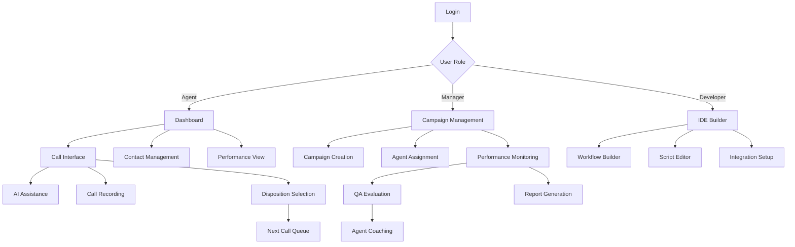

## 1. Product Overview

An enterprise-grade CRM Dialler platform that combines power dialling, contact management, and AI-powered conversations with an integrated development environment for building custom call scripts, workflows, and automations. The platform enables sales teams to manage customer relationships, automate calling processes, and leverage AI for real-time conversation assistance and quality monitoring.

Target market: Mid-to-large enterprises, call centers, and sales organizations requiring advanced dialling capabilities with customizable workflows and AI integration.

## 2. Core Features

### 2.1 User Roles

| Role | Registration Method | Core Permissions |
|------|---------------------|------------------|
| Admin | Admin panel invitation | Full system access, user management, billing, integrations, security settings |
| Manager | Admin assignment | Campaign management, team monitoring, QA evaluation, reports, agent coaching |
| Agent | Manager invitation | Make/receive calls, update contacts, log activities, view assigned leads, personal dashboard |
| QA Analyst | Manager assignment | Call recording access, scorecard evaluation, coaching notes, quality reports |
| Developer | Admin assignment | API access, workflow builder, custom scripts, integration setup, sandbox environment |

### 2.2 Feature Module

Our CRM Dialler platform requirements consist of the following main pages:

1. **Dashboard**: Real-time KPI widgets, agent status board, performance charts, campaign overview
2. **Contacts**: Contact list, import/export, contact details, activity timeline, custom fields
3. **Campaigns**: Campaign management, dialler configuration, contact assignment, performance tracking
4. **IDE Builder**: Visual workflow builder, script editor, template library, testing environment
5. **Calls**: Active calls interface, call controls, contact information, AI assistance panel
6. **Recordings**: Call recordings library, playback controls, transcription, QA scoring
7. **Reports**: Custom report builder, pre-built reports, analytics dashboard, export options
8. **Settings**: User management, integrations, compliance settings, billing, security

### 2.3 Page Details

| Page Name | Module Name | Feature description |
|-----------|-------------|---------------------|
| Dashboard | KPI Widgets | Display active calls, daily stats, conversion rates, revenue, service level metrics |
| Dashboard | Charts | Show calls by hour, outcomes pie chart, agent leaderboard, geographic heat map |
| Dashboard | Agent Status | Real-time agent availability, current activity, queue depth |
| Contacts | Contact List | Searchable contact database with filters, sorting, bulk actions |
| Contacts | Import/Export | CSV, Excel, JSON, XML import/export with deduplication |
| Contacts | Contact Details | Personal info, company info, custom fields, tags, lead score, lifecycle stage |
| Contacts | Activity Timeline | Chronological call/email/SMS history with agent attribution |
| Campaigns | Campaign List | Create, edit, delete campaigns with status tracking |
| Campaigns | Dialler Configuration | Predictive, power, preview, progressive modes with ratio settings |
| Campaigns | Contact Assignment | Auto-assignment rules, manual assignment, queue management |
| Campaigns | Performance Tracking | Real-time and historical campaign metrics |
| IDE Builder | Visual Workflow | Drag-drop nodes, connection logic, flow validation, version control |
| IDE Builder | Script Editor | Monaco editor with syntax highlighting, autocomplete, debugging tools |
| IDE Builder | Template Library | Pre-built templates for cold calling, appointments, surveys, collections |
| IDE Builder | Testing Environment | Call simulation, variable inspection, step-through debugging |
| Calls | Call Interface | Dial pad, call controls, contact info display, note-taking |
| Calls | AI Assistance | Real-time transcription, sentiment analysis, suggested responses |
| Recordings | Recording Library | Searchable recordings with filters, secure playback |
| Recordings | QA Scoring | Scorecard completion, automated QA metrics, feedback notes |
| Reports | Report Builder | Drag-drop fields, filters, grouping, calculated fields |
| Reports | Pre-built Reports | Agent performance, campaign ROI, compliance audit, satisfaction scores |
| Settings | User Management | Role assignment, permissions, team structure |
| Settings | Integrations | CRM, email, telephony, AI service connections |
| Settings | Compliance | DNC list management, consent tracking, audit logs |

## 3. Core Process

### Agent Flow:
1. Agent logs into platform and sets availability status
2. Agent joins campaign queue or receives manual call assignment
3. System initiates call based on dialler mode configuration
4. During call: agent views contact info, takes notes, receives AI coaching
5. Call ends: agent selects disposition, system logs activity
6. Post-call: agent completes wrap-up tasks, system queues next call

### Manager Flow:
1. Manager creates campaign with target criteria and dialler settings
2. Manager assigns contacts and agents to campaign
3. Manager monitors real-time dashboard and agent performance
4. Manager reviews call recordings and completes QA evaluations
5. Manager generates reports and provides agent coaching feedback

### Developer Flow:
1. Developer accesses IDE builder to create custom workflows
2. Developer writes scripts using Monaco editor with testing tools
3. Developer deploys workflows to campaigns with version control
4. Developer configures integrations and API connections
5. Developer monitors workflow performance and makes optimizations

## 4. User Interface Design

### 4.1 Design Style

- **Primary Colors**: Deep blue (#1e40af) for primary actions, slate gray (#64748b) for secondary
- **Secondary Colors**: Green (#10b981) for success, red (#ef4444) for errors, amber (#f59e0b) for warnings
- **Button Style**: Rounded corners (8px radius), subtle shadows, hover animations
- **Font**: Inter for UI elements, monospace for code editor (Fira Code)
- **Layout**: Card-based design with consistent spacing (8px grid system)
- **Icons**: Heroicons for UI elements, custom icons for telephony features

### 4.2 Page Design Overview

| Page Name | Module Name | UI Elements |
|-----------|-------------|-------------|
| Dashboard | KPI Widgets | Card-based widgets with real-time counters, progress bars, trend indicators |
| Dashboard | Charts | Interactive charts with hover tooltips, zoom/pan controls, export options |
| Call Interface | Dial Pad | Large numeric buttons, call control bar with mute/hold/transfer |
| Call Interface | Contact Info | Collapsible sidebar with contact details, activity history |
| IDE Builder | Workflow Canvas | Drag-drop canvas with zoom controls, node connection lines, mini-map |
| IDE Builder | Code Editor | Monaco editor with syntax highlighting, line numbers, debugging panel |
| Contacts | List View | Data table with sorting, filtering, bulk selection actions |
| Recordings | Player | Waveform visualization with playback controls, timestamp bookmarks |

### 4.3 Responsiveness

Desktop-first design approach with mobile-responsive layouts. Touch interaction optimization for tablet use. Key features available on mobile app for iOS/Android.

### 4.4 3D Scene Guidance

Not applicable for this CRM dialler platform.