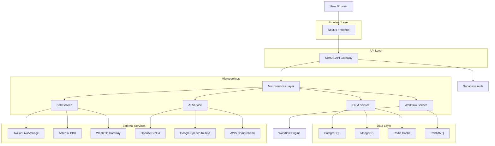
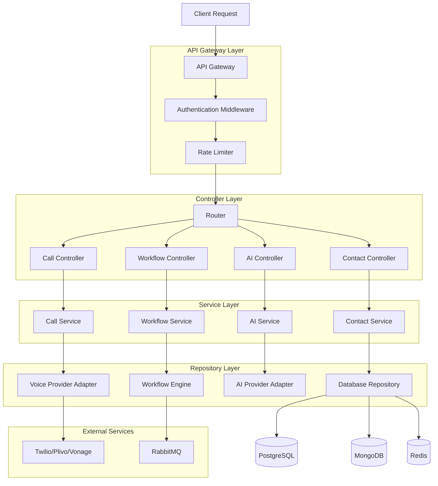
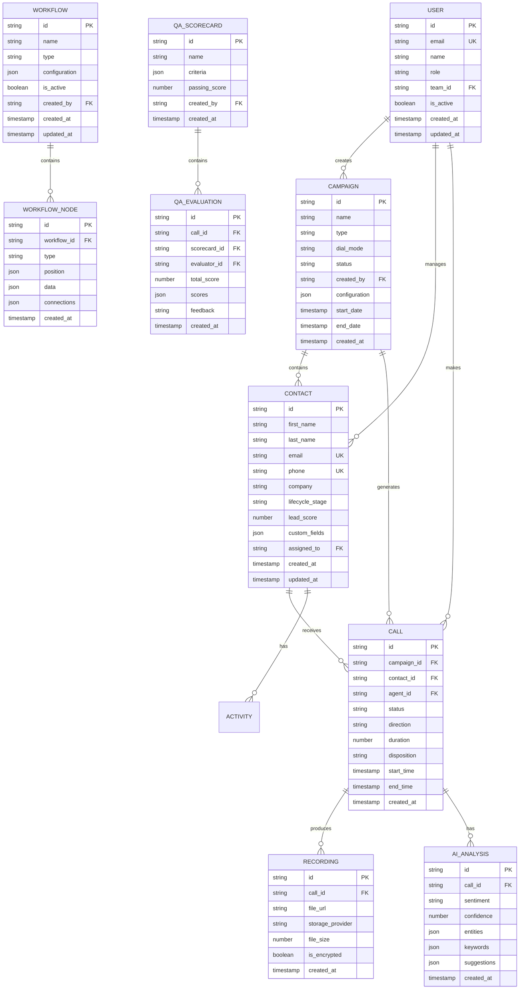

## 1. Architecture Design



## 2. Technology Description

- **Frontend**: Next.js 14 + React 18 + TypeScript + TailwindCSS + shadcn/ui
- **State Management**: Zustand (client state) + React Query (server state)
- **Real-time**: Socket.io-client + WebSocket API
- **Code Editor**: Monaco Editor (VS Code engine)
- **Initialization Tool**: Next.js CLI
- **Backend**: NestJS (microservices architecture) + Node.js + Express.js
- **Database**: PostgreSQL (primary) + MongoDB (recordings metadata) + Redis (sessions/queues)
- **Message Queue**: RabbitMQ
- **Voice Infrastructure**: Twilio, Plivo, Vonage, Amazon Connect, Asterisk PBX, WebRTC
- **AI/ML**: OpenAI GPT-4, Google Speech-to-Text, AWS Comprehend, Hugging Face models
- **Infrastructure**: Docker + Kubernetes + AWS (EC2, S3, Lambda) + CloudFlare + Terraform

## 3. Route Definitions

| Route | Purpose |
|-------|---------|
| / | Dashboard with real-time KPIs and agent status |
| /login | User authentication with SSO/MFA support |
| /contacts | Contact management with import/export capabilities |
| /contacts/[id] | Individual contact details and activity timeline |
| /campaigns | Campaign creation and management |
| /campaigns/[id] | Campaign configuration and performance tracking |
| /ide-builder | Visual workflow builder and script editor |
| /calls | Active call interface with AI assistance |
| /recordings | Call recordings library with QA tools |
| /reports | Analytics dashboard and custom report builder |
| /settings | System configuration and user management |
| /api/auth/* | Authentication endpoints (login, logout, refresh) |
| /api/contacts/* | Contact CRUD operations |
| /api/campaigns/* | Campaign management APIs |
| /api/calls/* | Call initiation and control APIs |
| /api/recordings/* | Recording access and transcription APIs |
| /api/ai/* | AI analysis and conversation APIs |
| /api/workflows/* | Workflow execution and management |

## 4. API Definitions

### 4.1 Authentication APIs

```
POST /api/auth/login
```

Request:
| Param Name | Param Type | isRequired | Description |
|------------|------------|-------------|-------------|
| email | string | true | User email address |
| password | string | true | User password |
| mfaCode | string | false | MFA code if enabled |

Response:
| Param Name | Param Type | Description |
|------------|-------------|-------------|
| accessToken | string | JWT access token |
| refreshToken | string | JWT refresh token |
| user | object | User profile data |
| permissions | array | User role permissions |

### 4.2 Call APIs

```
POST /api/calls/initiate
```

Request:
| Param Name | Param Type | isRequired | Description |
|------------|------------|-------------|-------------|
| contactId | string | true | Contact ID to call |
| campaignId | string | false | Campaign context |
| agentId | string | true | Agent making the call |
| dialMode | string | true | predictive/power/preview/progressive |

Response:
| Param Name | Param Type | Description |
|------------|-------------|-------------|
| callId | string | Unique call identifier |
| status | string | call status (initiated/connected/failed) |
| recordingId | string | Recording identifier if enabled |
| aiSessionId | string | AI assistance session ID |

### 4.3 Contact APIs

```
GET /api/contacts?page=1&limit=50&search=john
```

Query Parameters:
| Param Name | Param Type | isRequired | Description |
|------------|------------|-------------|-------------|
| page | number | false | Page number (default: 1) |
| limit | number | false | Items per page (default: 50) |
| search | string | false | Search term |
| tags | array | false | Filter by tags |
| lifecycle | string | false | Filter by lifecycle stage |

Response:
| Param Name | Param Type | Description |
|------------|-------------|-------------|
| contacts | array | Array of contact objects |
| total | number | Total contact count |
| page | number | Current page number |
| hasMore | boolean | Indicates more pages available |

### 4.4 AI APIs

```
POST /api/ai/analyze-sentiment
```

Request:
| Param Name | Param Type | isRequired | Description |
|------------|------------|-------------|-------------|
| text | string | true | Text to analyze |
| callId | string | false | Associated call ID |
| language | string | false | Language code (default: en) |

Response:
| Param Name | Param Type | Description |
|------------|-------------|-------------|
| sentiment | string | positive/neutral/negative |
| confidence | number | Analysis confidence score |
| entities | array | Extracted entities |
| keywords | array | Key phrases identified |

## 5. Server Architecture Diagram



## 6. Data Model

### 6.1 Data Model Definition



### 6.2 Data Definition Language

```sql
-- Users table
CREATE TABLE users (
    id UUID PRIMARY KEY DEFAULT gen_random_uuid(),
    email VARCHAR(255) UNIQUE NOT NULL,
    name VARCHAR(255) NOT NULL,
    password_hash VARCHAR(255) NOT NULL,
    role VARCHAR(50) NOT NULL CHECK (role IN ('admin', 'manager', 'agent', 'qa_analyst', 'developer')),
    team_id UUID,
    is_active BOOLEAN DEFAULT true,
    created_at TIMESTAMP WITH TIME ZONE DEFAULT NOW(),
    updated_at TIMESTAMP WITH TIME ZONE DEFAULT NOW()
);

-- Campaigns table
CREATE TABLE campaigns (
    id UUID PRIMARY KEY DEFAULT gen_random_uuid(),
    name VARCHAR(255) NOT NULL,
    type VARCHAR(50) NOT NULL CHECK (type IN ('outbound', 'inbound', 'mixed')),
    dial_mode VARCHAR(50) NOT NULL CHECK (dial_mode IN ('predictive', 'power', 'preview', 'progressive')),
    status VARCHAR(50) NOT NULL CHECK (status IN ('draft', 'active', 'paused', 'completed')),
    created_by UUID REFERENCES users(id),
    configuration JSONB NOT NULL DEFAULT '{}',
    start_date TIMESTAMP WITH TIME ZONE,
    end_date TIMESTAMP WITH TIME ZONE,
    created_at TIMESTAMP WITH TIME ZONE DEFAULT NOW()
);

-- Contacts table
CREATE TABLE contacts (
    id UUID PRIMARY KEY DEFAULT gen_random_uuid(),
    first_name VARCHAR(100) NOT NULL,
    last_name VARCHAR(100) NOT NULL,
    email VARCHAR(255),
    phone VARCHAR(50),
    company VARCHAR(255),
    lifecycle_stage VARCHAR(50) CHECK (lifecycle_stage IN ('lead', 'prospect', 'customer', 'churned')),
    lead_score INTEGER DEFAULT 0,
    custom_fields JSONB DEFAULT '{}',
    assigned_to UUID REFERENCES users(id),
    created_at TIMESTAMP WITH TIME ZONE DEFAULT NOW(),
    updated_at TIMESTAMP WITH TIME ZONE DEFAULT NOW(),
    UNIQUE(email, phone)
);

-- Calls table
CREATE TABLE calls (
    id UUID PRIMARY KEY DEFAULT gen_random_uuid(),
    campaign_id UUID REFERENCES campaigns(id),
    contact_id UUID REFERENCES contacts(id),
    agent_id UUID REFERENCES users(id),
    status VARCHAR(50) NOT NULL CHECK (status IN ('initiated', 'ringing', 'connected', 'completed', 'failed', 'abandoned')),
    direction VARCHAR(50) NOT NULL CHECK (direction IN ('inbound', 'outbound')),
    duration INTEGER DEFAULT 0,
    disposition VARCHAR(100),
    start_time TIMESTAMP WITH TIME ZONE,
    end_time TIMESTAMP WITH TIME ZONE,
    created_at TIMESTAMP WITH TIME ZONE DEFAULT NOW()
);

-- Recordings table
CREATE TABLE recordings (
    id UUID PRIMARY KEY DEFAULT gen_random_uuid(),
    call_id UUID REFERENCES calls(id),
    file_url TEXT NOT NULL,
    storage_provider VARCHAR(50) NOT NULL,
    file_size BIGINT,
    is_encrypted BOOLEAN DEFAULT true,
    created_at TIMESTAMP WITH TIME ZONE DEFAULT NOW()
);

-- AI Analysis table
CREATE TABLE ai_analysis (
    id UUID PRIMARY KEY DEFAULT gen_random_uuid(),
    call_id UUID REFERENCES calls(id),
    sentiment VARCHAR(50) CHECK (sentiment IN ('positive', 'neutral', 'negative')),
    confidence DECIMAL(3,2),
    entities JSONB DEFAULT '[]',
    keywords JSONB DEFAULT '[]',
    suggestions JSONB DEFAULT '[]',
    created_at TIMESTAMP WITH TIME ZONE DEFAULT NOW()
);

-- Workflows table
CREATE TABLE workflows (
    id UUID PRIMARY KEY DEFAULT gen_random_uuid(),
    name VARCHAR(255) NOT NULL,
    type VARCHAR(50) NOT NULL CHECK (type IN ('call_script', 'automation', 'integration')),
    configuration JSONB NOT NULL DEFAULT '{}',
    is_active BOOLEAN DEFAULT true,
    created_by UUID REFERENCES users(id),
    created_at TIMESTAMP WITH TIME ZONE DEFAULT NOW(),
    updated_at TIMESTAMP WITH TIME ZONE DEFAULT NOW()
);

-- Workflow nodes table
CREATE TABLE workflow_nodes (
    id UUID PRIMARY KEY DEFAULT gen_random_uuid(),
    workflow_id UUID REFERENCES workflows(id),
    type VARCHAR(50) NOT NULL CHECK (type IN ('trigger', 'condition', 'action', 'ai', 'integration')),
    position JSONB NOT NULL,
    data JSONB NOT NULL DEFAULT '{}',
    connections JSONB DEFAULT '{}',
    created_at TIMESTAMP WITH TIME ZONE DEFAULT NOW()
);

-- QA Scorecards table
CREATE TABLE qa_scorecards (
    id UUID PRIMARY KEY DEFAULT gen_random_uuid(),
    name VARCHAR(255) NOT NULL,
    criteria JSONB NOT NULL,
    passing_score INTEGER NOT NULL,
    created_by UUID REFERENCES users(id),
    created_at TIMESTAMP WITH TIME ZONE DEFAULT NOW()
);

-- QA Evaluations table
CREATE TABLE qa_evaluations (
    id UUID PRIMARY KEY DEFAULT gen_random_uuid(),
    call_id UUID REFERENCES calls(id),
    scorecard_id UUID REFERENCES qa_scorecards(id),
    evaluator_id UUID REFERENCES users(id),
    total_score INTEGER NOT NULL,
    scores JSONB NOT NULL,
    feedback TEXT,
    created_at TIMESTAMP WITH TIME ZONE DEFAULT NOW()
);

-- Activities table for contact timeline
CREATE TABLE activities (
    id UUID PRIMARY KEY DEFAULT gen_random_uuid(),
    contact_id UUID REFERENCES contacts(id),
    user_id UUID REFERENCES users(id),
    type VARCHAR(50) NOT NULL CHECK (type IN ('call', 'email', 'sms', 'meeting', 'note')),
    title VARCHAR(255) NOT NULL,
    description TEXT,
    metadata JSONB DEFAULT '{}',
    created_at TIMESTAMP WITH TIME ZONE DEFAULT NOW()
);

-- Create indexes for performance
CREATE INDEX idx_users_email ON users(email);
CREATE INDEX idx_users_role ON users(role);
CREATE INDEX idx_contacts_email ON contacts(email);
CREATE INDEX idx_contacts_phone ON contacts(phone);
CREATE INDEX idx_contacts_assigned_to ON contacts(assigned_to);
CREATE INDEX idx_calls_agent_id ON calls(agent_id);
CREATE INDEX idx_calls_contact_id ON calls(contact_id);
CREATE INDEX idx_calls_campaign_id ON calls(campaign_id);
CREATE INDEX idx_calls_status ON calls(status);
CREATE INDEX idx_calls_created_at ON calls(created_at);
CREATE INDEX idx_activities_contact_id ON activities(contact_id);
CREATE INDEX idx_activities_created_at ON activities(created_at DESC);

-- Grant permissions for Supabase
GRANT SELECT ON ALL TABLES TO anon;
GRANT ALL PRIVILEGES ON ALL TABLES TO authenticated;
GRANT USAGE ON ALL SEQUENCES TO authenticated;
```