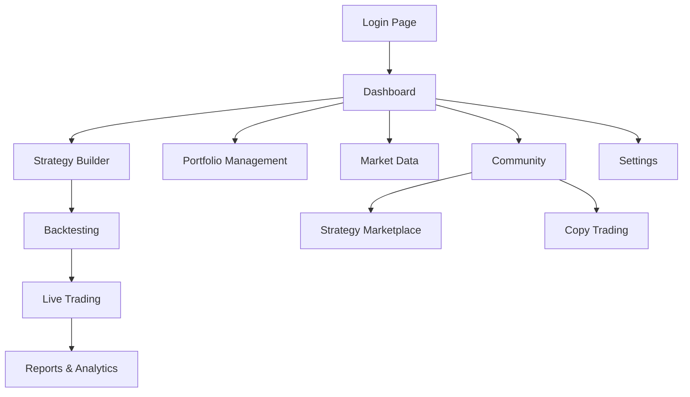

## 1. Product Overview
A comprehensive algorithmic trading platform that enables traders to create, backtest, and deploy automated trading strategies across multiple asset classes. The platform combines AI-powered analysis with multi-broker integration to democratize algorithmic trading for both retail and institutional traders.

The platform solves the problem of complex strategy development and testing by providing visual tools, extensive market data, and seamless broker connectivity. It helps traders optimize their strategies through advanced backtesting and deploy them with professional-grade risk management.

## 2. Core Features

### 2.1 User Roles
| Role | Registration Method | Core Permissions |
|------|---------------------|------------------|
| Free User | Email registration | 1 active strategy, basic backtesting, paper trading, community indicators |
| Pro User | Subscription upgrade ($49/month) | 10 active strategies, full historical data, live trading (1 broker), advanced indicators |
| Enterprise User | Custom contract | Unlimited strategies, multi-broker support, dedicated infrastructure, API access |

### 2.2 Feature Module
The algorithmic trading platform consists of the following main pages:
1. **Dashboard**: portfolio overview, real-time P&L, open positions, market overview, watchlists
2. **Strategy Builder**: visual designer, code editor, condition builder, indicator library
3. **Backtesting**: strategy testing, performance metrics, optimization engine, simulation results
4. **Live Trading**: order management, broker connections, risk controls, position tracking
5. **Portfolio Management**: allocation optimizer, correlation analysis, rebalancing tools
6. **Market Data**: real-time quotes, historical data, alternative data sources
7. **Reports & Analytics**: performance reports, trade analysis, compliance reports
8. **Community**: strategy marketplace, social features, copy trading, forums
9. **Settings**: user profile, broker connections, API keys, notifications

### 2.3 Page Details
| Page Name | Module Name | Feature description |
|-----------|-------------|---------------------|
| Dashboard | Portfolio Overview | Display real-time P&L, total equity, cash balance, margin usage with interactive charts |
| Dashboard | Open Positions | Show current holdings with entry prices, unrealized P&L, position sizes, risk metrics |
| Dashboard | Market Overview | Display market indices, sector performance, economic calendar, news feed |
| Dashboard | Watchlists | Create and manage multiple watchlists with real-time quotes and alerts |
| Strategy Builder | Visual Designer | Drag-and-drop interface for creating entry/exit conditions, risk rules, position sizing |
| Strategy Builder | Code Editor | Multi-language IDE with syntax highlighting, auto-completion, version control |
| Strategy Builder | Condition Builder | Create complex trading conditions with technical indicators, fundamentals, sentiment |
| Strategy Builder | Indicator Library | Access 200+ built-in indicators, import custom indicators, share with community |
| Backtesting | Strategy Testing | Run backtests with historical data, configure market conditions, slippage modeling |
| Backtesting | Performance Metrics | Calculate returns, risk metrics, trade statistics with comprehensive reporting |
| Backtesting | Optimization Engine | Optimize parameters using genetic algorithms, grid search, walk-forward analysis |
| Backtesting | Simulation Results | Visualize equity curves, drawdown charts, trade distributions with export options |
| Live Trading | Order Management | Create, modify, cancel orders with real-time status tracking and fill confirmations |
| Live Trading | Broker Connections | Connect to multiple brokers, manage API credentials, monitor connection status |
| Live Trading | Risk Controls | Set position limits, daily loss limits, emergency stop, real-time monitoring |
| Live Trading | Position Tracking | Monitor live positions, P&L updates, order executions, portfolio exposure |
| Portfolio Management | Allocation Optimizer | Optimize capital allocation across strategies using risk parity, Kelly criterion |
| Portfolio Management | Correlation Analysis | Analyze strategy correlations, sector exposure, risk concentration |
| Portfolio Management | Rebalancing Tools | Schedule rebalancing, set thresholds, tax-loss harvesting optimization |
| Market Data | Real-time Quotes | Stream real-time price data, level 2 quotes, options chains across asset classes |
| Market Data | Historical Data | Access 10+ years daily data, 2+ years intraday data with multiple timeframes |
| Market Data | Alternative Data | Integrate news sentiment, social media data, insider trading, economic indicators |
| Reports & Analytics | Performance Reports | Generate daily P&L, monthly tearsheets, attribution analysis with custom date ranges |
| Reports & Analytics | Trade Analysis | Analyze trade execution quality, slippage, commission costs with benchmarking |
| Reports & Analytics | Compliance Reports | Create audit trails, order history, risk breach reports for regulatory compliance |
| Community | Strategy Marketplace | Browse, purchase, and publish trading strategies with performance verification |
| Community | Social Features | Follow traders, share signals, participate in forums, live chat rooms |
| Community | Copy Trading | Automatically copy trades from successful strategy creators with risk controls |
| Settings | User Profile | Manage account settings, subscription plans, notification preferences |
| Settings | Broker Connections | Configure API keys for supported brokers, test connections, manage permissions |
| Settings | API Keys | Generate and manage API keys for programmatic access with usage monitoring |

## 3. Core Process

### User Flow - Strategy Creation and Deployment
1. User registers and logs into the platform
2. User navigates to Strategy Builder to create a new strategy
3. User chooses between visual designer or code editor approach
4. User defines entry conditions using technical indicators, price patterns, or fundamental criteria
5. User sets exit conditions including take profit, stop loss, and trailing stops
6. User configures position sizing rules and risk management parameters
7. User saves the strategy and navigates to Backtesting page
8. User selects historical data range and market conditions for testing
9. User runs backtest and analyzes performance metrics and equity curves
10. User optimizes strategy parameters using built-in optimization engine
11. User validates strategy with out-of-sample testing and walk-forward analysis
12. User connects broker account in Settings page
13. User deploys strategy to live trading with paper trading first
14. User monitors real-time performance on Dashboard
15. User adjusts risk controls and position sizes based on market conditions

### Page Navigation Flow

## 4. User Interface Design

### 4.1 Design Style
- **Primary Colors**: Professional blue (#1E3A8A) for primary actions, green (#10B981) for positive values, red (#EF4444) for negative values
- **Secondary Colors**: Neutral grays (#6B7280, #9CA3AF) for secondary elements, white backgrounds
- **Button Style**: Rounded corners (8px radius), subtle shadows, hover effects with color transitions
- **Typography**: Inter font family, 14px base size, clear hierarchy with font weights 400, 500, 600, 700
- **Layout Style**: Card-based design with consistent spacing (8px grid system), top navigation with sidebar
- **Icons**: Material Design icons, consistent line weights, meaningful metaphors for financial concepts

### 4.2 Page Design Overview
| Page Name | Module Name | UI Elements |
|-----------|-------------|-------------|
| Dashboard | Portfolio Overview | Dark theme option, real-time updating numbers with smooth transitions, interactive charts with TradingView integration, card layout with consistent spacing |
| Strategy Builder | Visual Designer | Drag-and-drop canvas with connection lines, component library sidebar, property panel with form inputs, syntax highlighting for conditions |
| Backtesting | Performance Metrics | Data tables with sorting and filtering, interactive charts with zoom/pan, export buttons for reports, progress indicators during testing |
| Live Trading | Order Management | Real-time data grids with cell flashing for updates, order entry forms with validation, status badges with color coding |
| Market Data | Real-time Quotes | Candlestick charts with multiple timeframe buttons, watchlist tables with customizable columns, alert configuration dialogs |
| Community | Strategy Marketplace | Card grid layout for strategy listings, rating stars, performance badges, search and filter sidebar |

### 4.3 Responsiveness
- Desktop-first design approach with responsive breakpoints at 768px and 1024px
- Mobile-adaptive layout for portfolio monitoring and basic strategy management
- Touch interaction optimization for tablet devices
- Progressive Web App (PWA) capabilities for offline access to key features