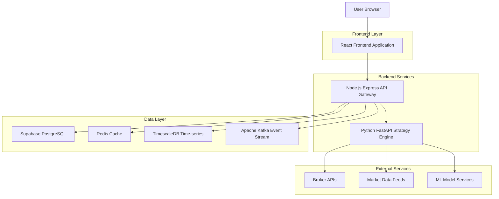
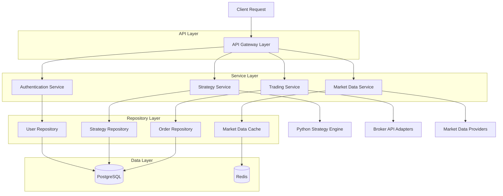
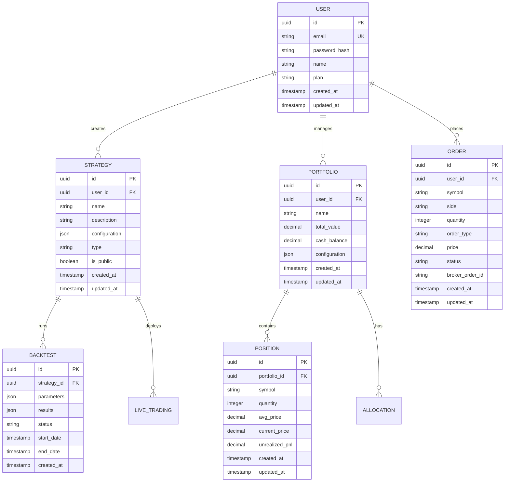

## 1. Architecture Design



## 2. Technology Description

- **Frontend**: React@18 + TypeScript + Redux Toolkit + Material-UI v5 + Tailwind CSS
- **Initialization Tool**: vite-init
- **Backend**: Node.js@18 + Express.js + Python FastAPI
- **Database**: Supabase (PostgreSQL) + TimescaleDB (time-series) + Redis (caching)
- **Real-time**: Socket.io + Apache Kafka
- **Charts**: TradingView Lightweight Charts + ag-Grid Enterprise
- **Container**: Docker + Kubernetes

## 3. Route Definitions

| Route | Purpose |
|-------|---------|
| / | Dashboard with portfolio overview and market data |
| /strategies | Strategy builder and management interface |
| /strategies/new | Create new strategy with visual designer or code editor |
| /strategies/:id | View and edit specific strategy |
| /strategies/:id/backtest | Run backtesting and view results |
| /portfolio | Portfolio management and allocation tools |
| /trading | Live trading interface with order management |
| /market-data | Market data viewer with charts and watchlists |
| /reports | Performance reports and analytics |
| /community | Strategy marketplace and social features |
| /settings | User settings and broker connections |
| /login | User authentication page |
| /register | User registration page |

## 4. API Definitions

### 4.1 Authentication APIs

```
POST /api/auth/login
```

Request:
| Param Name | Param Type | isRequired | Description |
|------------|------------|------------|-------------|
| email | string | true | User email address |
| password | string | true | User password |

Response:
| Param Name | Param Type | Description |
|------------|------------|-------------|
| token | string | JWT authentication token |
| user | object | User profile information |

Example:
```json
{
  "email": "trader@example.com",
  "password": "securepassword123"
}
```

### 4.2 Strategy APIs

```
POST /api/strategies
```

Request:
| Param Name | Param Type | isRequired | Description |
|------------|------------|------------|-------------|
| name | string | true | Strategy name |
| description | string | false | Strategy description |
| type | string | true | Strategy type (visual/code) |
| code | string | true | Strategy code or configuration |
| parameters | object | false | Strategy parameters |

Response:
| Param Name | Param Type | Description |
|------------|------------|-------------|
| id | string | Strategy unique identifier |
| status | string | Creation status |

### 4.3 Backtesting APIs

```
POST /api/strategies/:id/backtest
```

Request:
| Param Name | Param Type | isRequired | Description |
|------------|------------|------------|-------------|
| start_date | string | true | Backtest start date |
| end_date | string | true | Backtest end date |
| initial_capital | number | true | Initial capital amount |
| parameters | object | false | Strategy parameters |

Response:
| Param Name | Param Type | Description |
|------------|------------|-------------|
| backtest_id | string | Backtest run identifier |
| status | string | Backtest status |
| results | object | Performance metrics and statistics |

### 4.4 Trading APIs

```
POST /api/orders
```

Request:
| Param Name | Param Type | isRequired | Description |
|------------|------------|------------|-------------|
| symbol | string | true | Trading symbol |
| side | string | true | Buy/Sell |
| quantity | number | true | Order quantity |
| type | string | true | Order type (market/limit) |
| price | number | false | Limit price (if applicable) |

Response:
| Param Name | Param Type | Description |
|------------|------------|-------------|
| order_id | string | Order identifier |
| status | string | Order status |
| filled_quantity | number | Filled quantity |

## 5. Server Architecture Diagram



## 6. Data Model

### 6.1 Data Model Definition



### 6.2 Data Definition Language

**Users Table**
```sql
CREATE TABLE users (
    id UUID PRIMARY KEY DEFAULT gen_random_uuid(),
    email VARCHAR(255) UNIQUE NOT NULL,
    password_hash VARCHAR(255) NOT NULL,
    name VARCHAR(100) NOT NULL,
    plan VARCHAR(20) DEFAULT 'free' CHECK (plan IN ('free', 'pro', 'enterprise')),
    created_at TIMESTAMP WITH TIME ZONE DEFAULT NOW(),
    updated_at TIMESTAMP WITH TIME ZONE DEFAULT NOW()
);

-- Indexes
CREATE INDEX idx_users_email ON users(email);
CREATE INDEX idx_users_plan ON users(plan);
```

**Strategies Table**
```sql
CREATE TABLE strategies (
    id UUID PRIMARY KEY DEFAULT gen_random_uuid(),
    user_id UUID NOT NULL REFERENCES users(id) ON DELETE CASCADE,
    name VARCHAR(100) NOT NULL,
    description TEXT,
    configuration JSONB NOT NULL,
    type VARCHAR(20) NOT NULL CHECK (type IN ('visual', 'code', 'hybrid')),
    is_public BOOLEAN DEFAULT FALSE,
    created_at TIMESTAMP WITH TIME ZONE DEFAULT NOW(),
    updated_at TIMESTAMP WITH TIME ZONE DEFAULT NOW()
);

-- Indexes
CREATE INDEX idx_strategies_user_id ON strategies(user_id);
CREATE INDEX idx_strategies_type ON strategies(type);
CREATE INDEX idx_strategies_is_public ON strategies(is_public);
```

**Backtests Table**
```sql
CREATE TABLE backtests (
    id UUID PRIMARY KEY DEFAULT gen_random_uuid(),
    strategy_id UUID NOT NULL REFERENCES strategies(id) ON DELETE CASCADE,
    parameters JSONB NOT NULL,
    results JSONB,
    status VARCHAR(20) NOT NULL CHECK (status IN ('pending', 'running', 'completed', 'failed')),
    start_date DATE NOT NULL,
    end_date DATE NOT NULL,
    created_at TIMESTAMP WITH TIME ZONE DEFAULT NOW()
);

-- Indexes
CREATE INDEX idx_backtests_strategy_id ON backtests(strategy_id);
CREATE INDEX idx_backtests_status ON backtests(status);
CREATE INDEX idx_backtests_created_at ON backtests(created_at DESC);
```

**Portfolios Table**
```sql
CREATE TABLE portfolios (
    id UUID PRIMARY KEY DEFAULT gen_random_uuid(),
    user_id UUID NOT NULL REFERENCES users(id) ON DELETE CASCADE,
    name VARCHAR(100) NOT NULL,
    total_value DECIMAL(15,2) DEFAULT 0,
    cash_balance DECIMAL(15,2) DEFAULT 0,
    configuration JSONB,
    created_at TIMESTAMP WITH TIME ZONE DEFAULT NOW(),
    updated_at TIMESTAMP WITH TIME ZONE DEFAULT NOW()
);

-- Indexes
CREATE INDEX idx_portfolios_user_id ON portfolios(user_id);
```

**Positions Table**
```sql
CREATE TABLE positions (
    id UUID PRIMARY KEY DEFAULT gen_random_uuid(),
    portfolio_id UUID NOT NULL REFERENCES portfolios(id) ON DELETE CASCADE,
    symbol VARCHAR(20) NOT NULL,
    quantity INTEGER NOT NULL,
    avg_price DECIMAL(12,4) NOT NULL,
    current_price DECIMAL(12,4),
    unrealized_pnl DECIMAL(15,2) DEFAULT 0,
    created_at TIMESTAMP WITH TIME ZONE DEFAULT NOW(),
    updated_at TIMESTAMP WITH TIME ZONE DEFAULT NOW()
);

-- Indexes
CREATE INDEX idx_positions_portfolio_id ON positions(portfolio_id);
CREATE INDEX idx_positions_symbol ON positions(symbol);
```

**Orders Table**
```sql
CREATE TABLE orders (
    id UUID PRIMARY KEY DEFAULT gen_random_uuid(),
    user_id UUID NOT NULL REFERENCES users(id) ON DELETE CASCADE,
    symbol VARCHAR(20) NOT NULL,
    side VARCHAR(10) NOT NULL CHECK (side IN ('buy', 'sell')),
    quantity INTEGER NOT NULL,
    order_type VARCHAR(20) NOT NULL CHECK (order_type IN ('market', 'limit', 'stop', 'stop_limit')),
    price DECIMAL(12,4),
    status VARCHAR(20) NOT NULL CHECK (status IN ('pending', 'submitted', 'filled', 'cancelled', 'rejected')),
    broker_order_id VARCHAR(100),
    created_at TIMESTAMP WITH TIME ZONE DEFAULT NOW(),
    updated_at TIMESTAMP WITH TIME ZONE DEFAULT NOW()
);

-- Indexes
CREATE INDEX idx_orders_user_id ON orders(user_id);
CREATE INDEX idx_orders_symbol ON orders(symbol);
CREATE INDEX idx_orders_status ON orders(status);
CREATE INDEX idx_orders_created_at ON orders(created_at DESC);
```

**Supabase Row Level Security Policies**
```sql
-- Enable RLS
ALTER TABLE users ENABLE ROW LEVEL SECURITY;
ALTER TABLE strategies ENABLE ROW LEVEL SECURITY;
ALTER TABLE backtests ENABLE ROW LEVEL SECURITY;
ALTER TABLE portfolios ENABLE ROW LEVEL SECURITY;
ALTER TABLE positions ENABLE ROW LEVEL SECURITY;
ALTER TABLE orders ENABLE ROW LEVEL SECURITY;

-- Users can only see their own data
CREATE POLICY "Users can view own profile" ON users FOR SELECT USING (auth.uid() = id);
CREATE POLICY "Users can update own profile" ON users FOR UPDATE USING (auth.uid() = id);

-- Strategy policies
CREATE POLICY "Users can view own strategies" ON strategies FOR SELECT USING (auth.uid() = user_id);
CREATE POLICY "Users can create strategies" ON strategies FOR INSERT WITH CHECK (auth.uid() = user_id);
CREATE POLICY "Users can update own strategies" ON strategies FOR UPDATE USING (auth.uid() = user_id);
CREATE POLICY "Users can view public strategies" ON strategies FOR SELECT USING (is_public = true);

-- Portfolio and trading policies
CREATE POLICY "Users can manage own portfolios" ON portfolios FOR ALL USING (auth.uid() = user_id);
CREATE POLICY "Users can view own positions" ON positions FOR SELECT USING (auth.uid() IN (SELECT user_id FROM portfolios WHERE id = portfolio_id));
CREATE POLICY "Users can manage own orders" ON orders FOR ALL USING (auth.uid() = user_id);
```